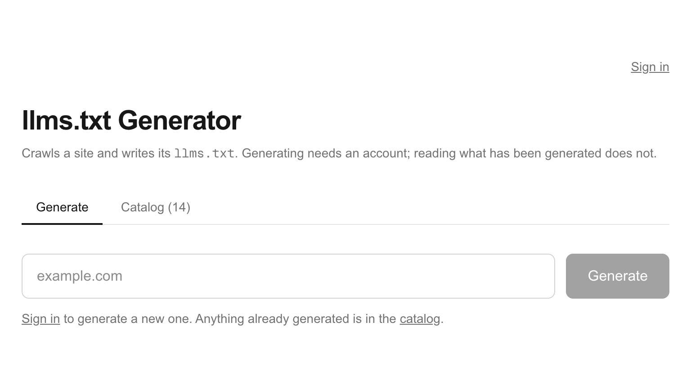
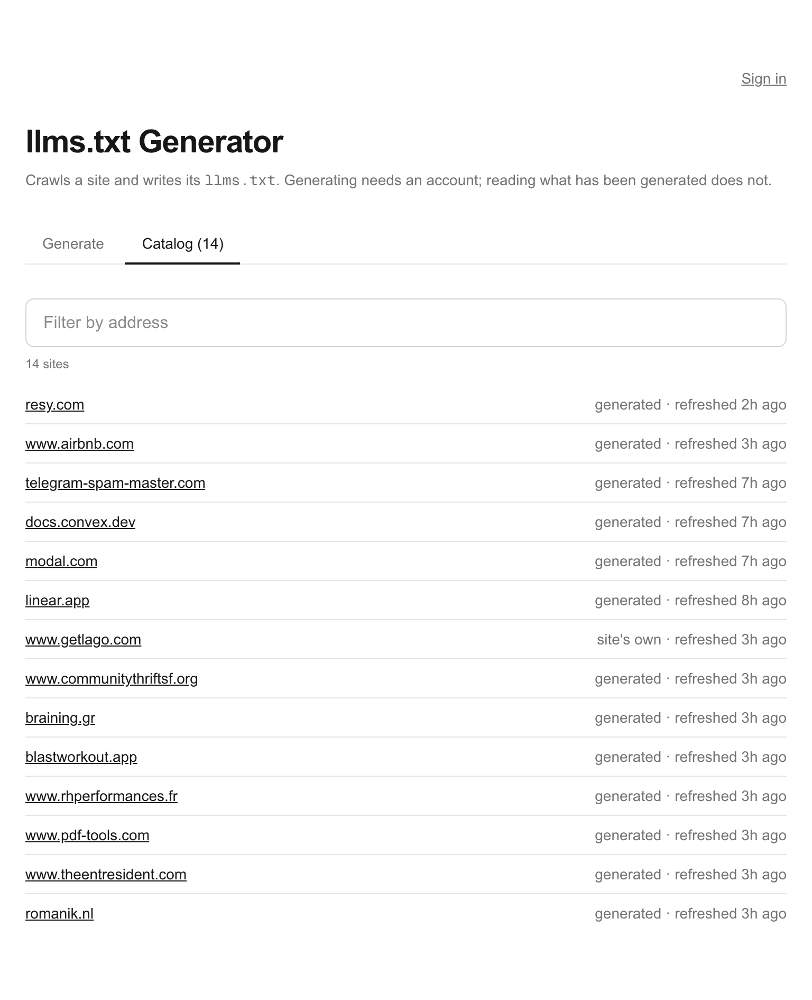
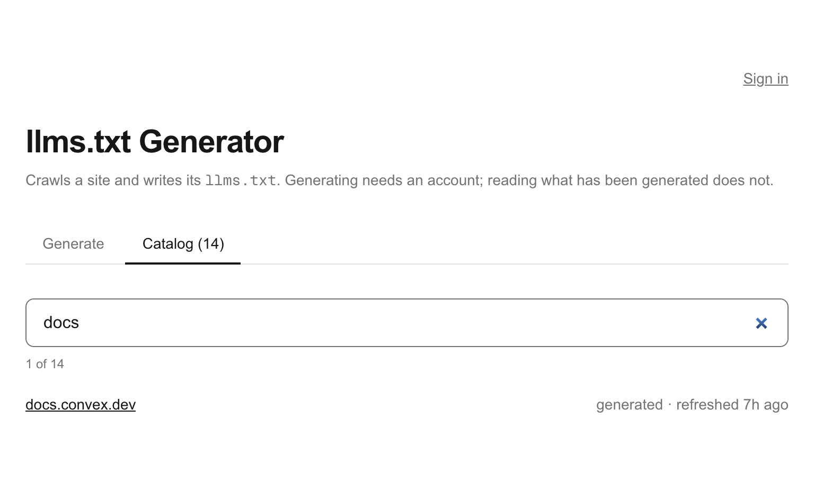
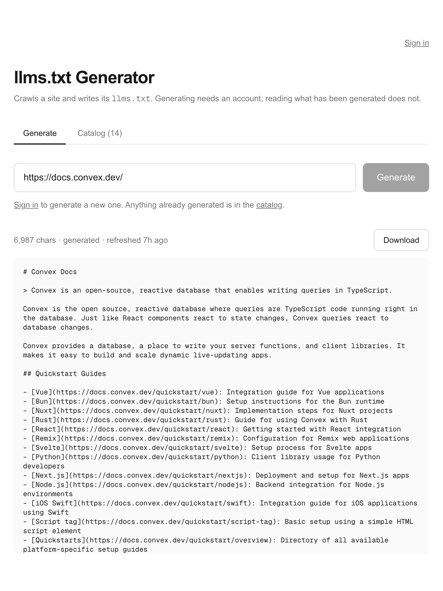

# llms.txt Generator

**Live: <https://llms-txt-keshav-chakrapani.vercel.app>**

A tool that generates an [`llms.txt`](https://llmstxt.org) file for a website, and keeps it up to
date as the site changes.

You enter a URL. If the site publishes its own `llms.txt`, that is the answer and it costs one
request. Otherwise the server crawls the site — sitemap and links, paced by what the site tolerates,
obeying `robots.txt` — extracts what each page says about itself, groups the result into sections,
runs two model passes over it, and stores what it produced. A scheduled job re-checks stored sites
and rewrites the ones that have moved.

## Using it

**Enter a URL.** Anything the browser would accept - `resy.com`, `https://docs.convex.dev/`, or a
link copied out of an ad, campaign parameters and all. The address is reduced to the page it names
before anything else happens.



**Generating needs an account; reading does not.** Create one at `/login` - the same form signs up
and signs in, and any email address with a password of at least eight characters will do. The
account exists to gate the crawl and the model calls, which cost time and money, rather than to
protect anything: every file here describes public pages and every one of them is readable, and
downloadable, by anyone who visits. (If the deployment has Supabase's email confirmation switched
on, sign-up will ask you to confirm before you can sign in.)

**The catalog is everything anyone has generated**, filterable by address, newest first. Each row
says whether the file is one this tool wrote or one the site publishes itself, and when the site was
last checked - not when the file was last written, which for an unchanged site stops moving.



Typing filters it as you go, matching the address as displayed - `docs.c` finds `docs.convex.dev`,
and terms match in any order.



**Click any row to read its file.** No account, no regeneration - the stored file, with a Download
button.



**Generating a site that already has a file asks which you meant** - show the saved one, or crawl
again and write a new one over it. A site that publishes its own `llms.txt` says so instead, and
offers to generate one anyway.

While a real generation runs, the response is narrated a line at a time: fetching, rendering if the
page needs a browser, crawling with a page count, then the two model passes. A run takes anywhere
from a few seconds to a minute and a half depending on the site.

The screenshots above are taken from the live deployment by `node scripts/screenshots.mjs`, so they
can be retaken rather than re-staged.

## Setup

```bash
npm install
cp .env.example .env    # then fill it in; see Environment below
npm run dev
```

Open <http://localhost:3000> and enter a URL.

Nothing is strictly required to *run* the app, but the parts each variable switches on are not
optional to the product:

| without | what happens |
|---|---|
| `SUPABASE_URL` + `SUPABASE_PUBLISHABLE_KEY` | there are no accounts, so generating answers 503 |
| `SUPABASE_SECRET_KEY` | nothing is stored, so nothing is monitored and the saved list is empty |
| `OPENROUTER_API_KEY` | the file is built deterministically, with no summary or per-link notes |

A first run also needs the table: apply [`db/schema.sql`](db/schema.sql) in the Supabase SQL editor.

## How it works

```
TEMPLATE.txt             the target shape, and the rules the extractor follows
db/schema.sql            the one table, and the migrations that grew and pruned it
app/
  page.tsx               the catalog, server-rendered; Generator.tsx is the client half
  login/                 email + password sign-in
  api/generate/route.ts  POST { url } -> published? -> crawl -> models -> store
  api/saved/route.ts     GET the saved list, or one file. No account needed.
  api/refresh/route.ts   POST, cron-authenticated: re-check what is due
proxy.ts                 refreshes the Supabase session (Next 16's middleware)
lib/
  deadline.ts            one clock for the request, so the steps cannot outlast it
  progress.ts            what "generating" is made of, so a stage becomes a label and a percent
  fetchPage.ts           one page, with the SSRF guard and the block detector
  blocks.ts              telling a challenge page from a real one
  render.ts              a real browser, for sites whose links only exist after JavaScript
  published.ts           finding and recognising a site's own llms.txt
  crawl/
    crawl.ts             the crawl itself: discover, plan, fetch, collect
    plan.ts              what to fetch, decided before anything is fetched
    sitemap.ts           sitemap and sitemap-index discovery
    robots.ts            parsing robots.txt and applying it
    pacer.ts             how fast this site is willing to be asked
    url.ts               one address per page
  pageMeta.ts            what a crawled page says about itself
  buildFromCrawl.ts      crawled pages -> the same Extraction shape
  grouping.ts            links -> sections, and the caps that keep a file curated
  naiveExtractor.ts      a page -> { siteName, summary, sections } -> llms.txt
  dom.ts                 HTML -> a small tree that can be measured
  nlp.ts                 tokenizing, stemming, overlap, sentence splitting
  ai/                    the guide pass, the annotation pass, and the sieve
  spec.ts                the llmstxt.org grammar: escaping out, parsing back
  monitor.ts             fingerprints and the six-hour check interval
  store.ts               the generations table
  catalog.ts             how a saved site is written down, and how a person finds one
scripts/
  gate-deploy.mjs        Vercel's Ignored Build Step: no green CI, no deploy
  screenshots.mjs        the images above, retaken rather than re-staged
  bench.mjs              times the candidate models
  integration.mjs        grades output against sites that publish their own file
tests/
  fixtures.ts            mock pages, one per genre the extractor meets
  *.test.ts              node:test suites, run with `npm test`
```

`POST /api/generate` takes `{ "url": "example.com", "regenerate": false }` and answers in one of two
shapes, told apart by content type. A request with **nothing to do** — a saved file already answers
it — is a single `application/json` object. A request that **commits to real work** streams
`application/x-ndjson`, one object per line, as each stage starts and each page or chunk settles,
ending in a line carrying the result. The HTTP status is always 200 once a stream has started, so
the result line carries the status it would have had.

`GET /api/saved` returns the catalog, or one file, and needs no account.
`POST /api/refresh` is cron-authenticated and re-checks whatever is due.

## The parts worth knowing about

**It conforms to the spec, and proves it.** `lib/spec.ts` implements the
[llmstxt.org](https://llmstxt.org) grammar in both directions — escaping on the way out, parsing to
check on the way back — and every response reports the result. The suite includes the spec's own
example, seven files that must be rejected, and eight hostile pages run through the real pipeline.

**A site's own file wins.** If the site publishes an `llms.txt`, that is the answer: it is stored
and labelled as theirs, and the scheduled check re-reads it rather than crawling and replacing
someone's curation with ours.

**The crawl is deterministic.** Pages are planned before anything is fetched and results sorted back
into plan order, so the same site yields byte-identical output — which is what lets a content hash
mean "the site changed" rather than "a packet was slow".

**Pages are ranked, not taken alphabetically.** How often a site links to a page decides which
candidates are crawled, because that is the site voting on what matters and it costs nothing to
count. Sections get budget in proportion to their size, so two hundred documentation pages and two
careers pages are not treated as equally important.

**One link means one page.** URLs are canonicalised — fragments, trailing slashes, tracking
parameters, `index.html` — and titles compared by stemmed token overlap. Query strings are kept when
they name a page (`?title=X`) and dropped when they name a campaign. Operations on a page
(`?action=edit`, `?printable=yes`) are not pages and are dropped.

**Sections come from the site's own structure.** Links group by shared path segment, going a segment
deeper when one bucket would swallow the page; names come from the site's nav headings where one
covers the group. Capped at 25 links a section and 150 overall, because a sitemap is the thing
llms.txt exists not to be.

**Sites that need a browser get one.** When a fetch finds no links, Chromium runs in the function.
`resy.com` and `docs.convex.dev` return application shells and embed nothing a parser could use;
rendered, they are ordinary sites.

**Politeness is measured, not assumed.** The pacer widens on a 429, a 503, or a site simply getting
slower, and never narrows again within a crawl. On `getlago.com`, four workers at a 150ms gap fetched
30 pages in 2.7s where eight workers with no gap took 4.3s — asking harder made the site slower to
answer.

**One clock bounds the request.** Every step used to have its own timeout and nothing bounded their
sum, so a slow site ran past the function's limit and returned nothing, stored nothing, and left the
next attempt to die identically. `lib/deadline.ts` starts when the request arrives and every step
takes the shorter of its own cap and what remains.

**The wait is narrated.** Fetching, rendering, crawling with a page count, then the two model
passes — streamed as they happen rather than spent in silence.

**The models are on a leash.** A guide pass writes the summary and section names, a chunked pass
writes per-link notes, and a sieve drops anything a model invented. If the result would be worse or
invalid, the deterministic file is served instead. Model failures are told apart: retry with
jittered backoff on 429s and 5xx honouring `Retry-After`, stop immediately on 401/402.

**Refusals are told apart from emptiness.** A 403, an anti-bot challenge, and an application shell
need three different answers, and the output says which rather than describing Cloudflare's
verification page as though it were the site.

## Keeping it up to date

Every stored site is re-checked every six hours, and work is done cheapest first because most checks
find nothing:

| tier | cost | what it settles |
|---|---|---|
| the site's own `llms.txt`, if the row is one | 1 request | did their file change |
| the sitemap's fingerprint | 1 request | did the page list change |
| a crawl, fingerprinted without any model | ~9s | did the structure change |
| regenerate | ~30s | write the new file |

A tier only runs when the one above it was inconclusive. The comparison is a `structure_hash` — the
URLs and titles a deterministic crawl finds, with no model involved — because the file we serve is
AI-assisted and a change in *its* hash proves nothing about the site.

`.github/workflows/monitor.yml` calls `POST /api/refresh` every fifteen minutes until nothing is due.
The loop lives in the runner, which has six hours, while the crawling stays on the deployment, where
the credentials already are and where requests come from the app's own address rather than a shared
CI one. To set it up, add two repository secrets:

```
APP_URL       https://your-deployment.vercel.app
CRON_SECRET   the same value as the deployment's CRON_SECRET (openssl rand -hex 32)
```

## Tests

```bash
npm test          # 216 tests, node --test, no framework and no dependencies
npm run lint
npm run typecheck
```

All three run in CI on every pull request. Two more need a key and a network, so they do not:
`npm run bench` times the candidate models, and `npm run integration` grades the output against sites
that publish their own file.

## Environment

[`.env.example`](.env.example) documents every variable with what it does and where to get it.
The short version:

| variable | what it switches on |
|---|---|
| `SUPABASE_URL`, `SUPABASE_PUBLISHABLE_KEY` | accounts; without them generating answers 503 |
| `SUPABASE_SECRET_KEY` | the store, and therefore monitoring. Server only, never `NEXT_PUBLIC_` |
| `OPENROUTER_API_KEY` | the summary, the section names and the per-link notes |
| `CRON_SECRET` | `POST /api/refresh`; without it the endpoint refuses everything |
| `ALLOW_PRIVATE_CRAWL_TARGETS` | testing against a local server, past the SSRF guard |

The crawl and monitor tunables (`CRAWL_MAX_PAGES`, `MONITOR_*`) have working defaults and are
documented in `.env.example` beside the reasoning for each.

## Deployment

Deployed to Vercel as a standard Next.js app, from GitHub rather than from a laptop. Work reaches
`main` through a pull request; opening one runs CI and builds a preview, and merging deploys.

**CI gates the deploy, not just the merge.** Branch protection stops a red pull request being merged,
which sounds like enough and is not: Vercel builds on every push to main, starting the moment the
push lands — in parallel with that commit's CI run rather than after it. `scripts/gate-deploy.mjs`
runs as Vercel's Ignored Build Step, waits for the `ci` check on the exact commit, and skips the
build unless it passed. It needs no credentials, because the repository is public.

Two things about it are easy to get backwards. **The exit codes are inverted** — Vercel asks whether
the build should be *ignored*, so 0 skips and 1 builds. And **anything it cannot resolve fails
closed**: deploying because we could not find out whether the tests passed would make the gate
decoration.

CI pins Node 24 and pins npm to the exact version that writes `package-lock.json`, because `npm ci`
rejects a lock layout it would not have written itself. Regenerate the lock with
`npx npm@11.19.1 install`, matching `ci.yml`.

## Reading the history

[`SEQUENCE.md`](SEQUENCE.md) is the long version: every step in the order it was built, with the
measurement behind each decision — including the things that were tried and removed. A
browser-identity retry that could not be shown to work, a background crawl queue that bought nothing,
an adaptive check interval that throttled the cheap half of the system. The commit messages carry the
same reasoning at a finer grain.
